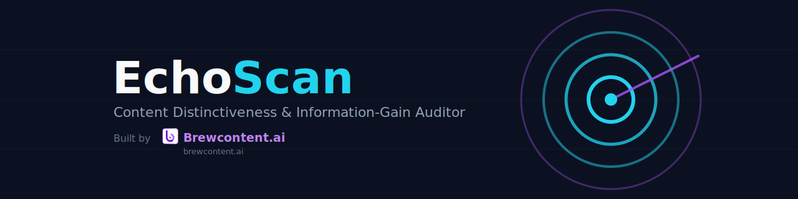

<p align="center">
  <a href="https://brewcontent.ai">
    
  </a>
</p>

# EchoScan

**Content Distinctiveness & Information-Gain Auditor**
*Built by [Brewcontent.ai](https://brewcontent.ai)*

Marketing teams generate more AI-assisted content than ever, and it's converging on the same phrasing, structure, and claims. Research on the 2026 content landscape consistently points to the same root problem: the content gap is no longer a lack of keywords — it's a lack of **information gain**, unique data or perspective that consensus-trained models can't produce, buried under AI-tell cliches that hurt both reader trust and AI-search visibility.

EchoScan is a small, focused CLI that scores any piece of content across three dimensions before you publish it:

1. **Genericness** — detects marketing/AI-tell cliches ("in today's fast-paced world," "unlock the full potential," "game changer") and filler-sentence density.
2. **Information Gain** — measures concrete evidence (numbers, dates, named sources, citations) against vague, unsupported claims ("studies show," "experts agree").
3. **Competitor Overlap** *(optional)* — TF-IDF cosine similarity against competitor content you supply locally, with shared-term breakdown.

These roll up into a single **Distinctiveness Score (0–100)** with a verdict and concrete, line-level suggestions — runnable locally, in CI, or as a pre-publish gate.

## Install

```bash
pip install -e .
```

Requires Python 3.9+.

## Usage

```bash
echoscan analyze path/to/content.txt
```

With competitor comparison:

```bash
echoscan analyze path/to/content.txt \
  --competitor path/to/competitor_a.txt \
  --competitor path/to/competitor_b.txt
```

Export the full report as JSON (for CI gates or dashboards):

```bash
echoscan analyze path/to/content.txt --json report.json --quiet
```

Try the bundled examples:

```bash
echoscan analyze examples/generic_sample.txt
echoscan analyze examples/distinctive_sample.txt --competitor examples/competitor_sample.txt
```

## Example output

```
EchoScan — Content Distinctiveness & Information-Gain Auditor
Built by Brewcontent.ai

generic_sample.txt  (142 words)
Distinctiveness Score: 18.4/100 — Highly generic — rewrite recommended before publishing.

Suggestions:
  → Cut or replace overused phrases (top offenders: "in today's fast-paced world",
    "game changer", "unlock the full potential")...
  → Add concrete evidence: original data, named sources, dates, or percentages...
```

## Library usage

```python
from echoscan import analyze

report = analyze(open("post.md").read(), source="post.md")
print(report.distinctiveness_score, report.verdict)
```

## Scoring methodology

All scoring is deterministic, local, and offline — no external API calls, no data leaves your machine:

- **Genericness** uses a curated cliche/filler-phrase library (`echoscan/patterns.py`) plus sentence-level filler detection.
- **Information Gain** uses regex-based evidence markers (percentages, currency, years, citations, sample sizes) and a lightweight named-entity heuristic, offset by vague-claim phrase detection.
- **Overlap** uses scikit-learn's TF-IDF vectorizer + cosine similarity against competitor text you provide directly (no scraping).

The pattern libraries in `patterns.py` are intentionally the easiest place to extend accuracy over time — add phrases relevant to your industry as you see them recur.

See [docs/ARCHITECTURE.md](docs/ARCHITECTURE.md) for the full design rationale, trade-offs, and extension points.

## Development

```bash
pip install -e ".[dev]"
pytest
ruff check src tests
```

CI runs the full test suite across Python 3.9–3.12 on every push (`.github/workflows/ci.yml`).

## Roadmap ideas

- Pluggable pattern packs per vertical (SaaS, fintech, healthcare)
- Optional embedding-based overlap scoring (vs. TF-IDF) for semantic similarity
- GitHub Action for automated pre-publish gating
- Batch/directory mode for auditing an entire content library at once

## License

MIT — see [LICENSE](LICENSE).

---

<p align="left">
  <a href="https://brewcontent.ai">
    
  </a>
</p>

Built by **[Brewcontent.ai](https://brewcontent.ai)**
