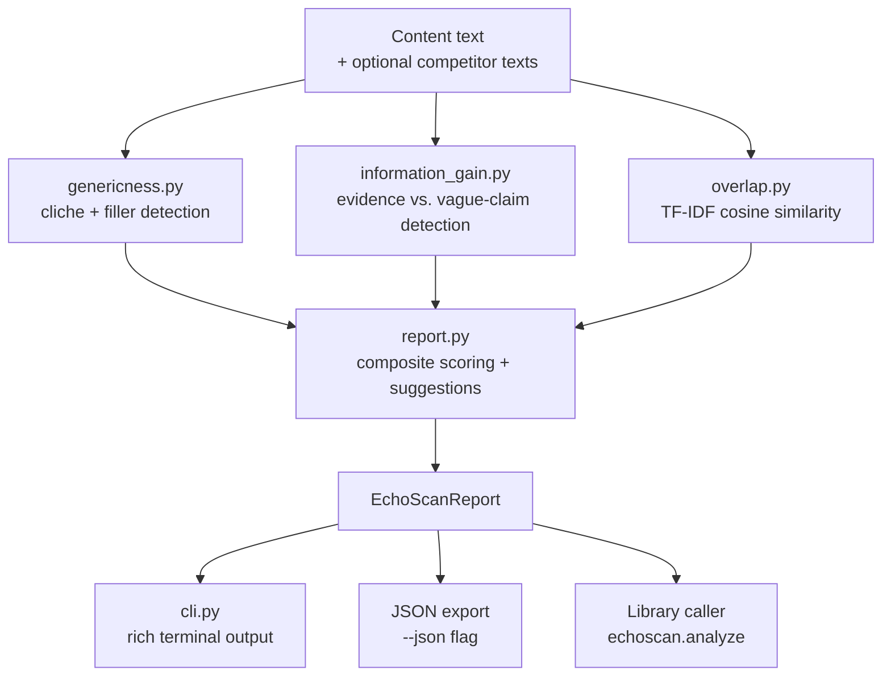

# EchoScan Architecture

*Built by Brewcontent.ai*

This document explains why EchoScan is built the way it is, how its pieces fit together, and the trade-offs behind its key decisions. It's aimed at anyone extending the scoring logic, adding a new signal, or evaluating whether to embed EchoScan into a larger pipeline.

## 1. Context and goals

EchoScan exists to answer one question before content gets published: *does this piece add anything the internet doesn't already have?* Research into the 2026 content landscape consistently frames the "content gap" not as a missing-keyword problem but as a missing-**information-gain** problem — content that reads as competent but interchangeable, because it leans on the same cliches, the same hedged claims, and the same angles every other AI-assisted draft reaches for.

Design goals, in priority order:

1. **Deterministic and offline.** Given the same input, EchoScan always returns the same score. No calls to an LLM, no calls to any external API. This makes it safe to run in CI, safe to run on content that hasn't been cleared for external sharing yet, and cheap to run at scale (no per-call cost, no rate limits).
2. **Explainable, not just a number.** Every score is backed by a list of the exact phrases, patterns, or terms that produced it. A black-box "73/100" is not actionable; "these 3 cliches, this vague-claim phrase, this competitor overlap" is.
3. **Small and extensible.** The scoring logic is intentionally simple (regex + TF-IDF, not embeddings or a classifier) so a marketer or engineer can open `patterns.py`, add a phrase relevant to their industry, and immediately see the effect — no retraining, no model dependency.
4. **Two integration surfaces.** A human-facing CLI for one-off checks, and a plain Python library (`echoscan.analyze()`) for embedding into CI gates, editorial tools, or other pipelines.

Non-goals: EchoScan does not generate or rewrite content, does not crawl competitor URLs itself (by design — see §4), and does not attempt true semantic/embedding-based similarity in v0.1.0 (see §4 and the README's roadmap).

## 2. High-level design

**Module responsibilities:**

- `patterns.py` — the only file most users will ever need to edit. Holds three static libraries: `CLICHE_PHRASES` (AI-tell/marketing filler), `VAGUE_CLAIM_PHRASES` (unsupported hedges like "studies show"), and `EVIDENCE_PATTERNS` (regexes for percentages, currency, years, citations, sample sizes) plus a proper-noun heuristic for named entities.
- `textutils.py` — shared normalization: whitespace collapsing, sentence splitting, word counting. Every scorer depends on this so word/sentence counts stay consistent across dimensions.
- `genericness.py` — scores 0–100, starting at 100 and subtracting for cliche density (per 100 words) and the fraction of sentences that are pure filler.
- `information_gain.py` — scores 0–100, starting at a baseline of 20 and adding for evidence-marker density and named-entity count, subtracting for vague-claim density.
- `overlap.py` — optional. Vectorizes the target text plus any supplied competitor texts with scikit-learn's `TfidfVectorizer`, computes cosine similarity, and surfaces the top shared terms per competitor. Degrades to zero-similarity (not a crash) when a corpus has no usable vocabulary — see §5.
- `report.py` — orchestrates the three scorers, computes the weighted composite `distinctiveness_score`, generates human-readable suggestions, and picks a verdict band.
- `models.py` — plain dataclasses for every result type, each with a `to_dict()` for JSON export. No behavior lives here beyond serialization.
- `cli.py` — Click-based CLI wrapping `analyze()`. Handles file I/O, rich terminal rendering, and JSON export. This is the only place user-derived strings (filenames, competitor labels) touch a formatting layer, so it's also where markup-escaping lives (see §6).

## 3. Data flow

1. CLI or library caller passes raw text (plus optional `{label: text}` competitor mapping) into `analyze()`.
2. `analyze()` fans out to all three scorers independently — they don't depend on each other's output, so they could be parallelized if performance ever mattered (it doesn't yet; typical inputs are single documents, not batches).
3. Each scorer returns a typed dataclass (`GenericnessResult`, `InformationGainResult`, `OverlapResult`) containing both the score and the raw evidence (which phrases matched, which terms overlapped) that produced it.
4. `report.py` combines the three scores into a weighted composite (35% genericness, 40% information gain, 25% overlap — renormalized to 35/40 when no competitors are supplied), assigns a verdict band, and generates suggestions by inspecting thresholds on each component result.
5. The assembled `EchoScanReport` is either rendered to the terminal (`cli.py`), serialized to JSON (`--json` flag), or returned directly to a library caller.

## 4. Key decisions and trade-offs

**Regex + TF-IDF over embeddings/LLM scoring.** An embedding-based similarity model or an LLM-as-judge would likely score genericness and overlap more accurately, especially for paraphrased (not just lexically similar) content. We chose the simpler approach for v0.1.0 because it's free to run, has zero external dependencies at inference time, is instantly explainable (you can point at the exact matched phrase), and is trivial to extend (add a string to a list vs. fine-tune a model). The README's roadmap explicitly calls out optional embedding-based overlap as a future addition — this is a deliberate v1 vs. v2 trade-off, not an oversight.

**No competitor URL fetching.** `overlap.py` only accepts text the caller supplies directly (via CLI file paths or library arguments) — it does not scrape URLs itself. This keeps the tool's network footprint at zero, avoids the legal/ethical complexity of automated scraping, and keeps runs deterministic and offline. Callers who want live competitor content are expected to fetch it themselves (e.g., via their own crawler or a separate tool) and hand EchoScan the text.

**Static pattern libraries over a trained classifier.** Cliche/vague-claim detection is a curated, hand-maintained list rather than a trained model. This is the single biggest accuracy lever in the system — and also its most honest limitation. It will not catch cliches phrased slightly differently than the list, and it may produce false positives on words that happen to match a phrase in an unintended context. The trade-off favors transparency and ease of tuning per industry over recall.

**Composite score weighting is a fixed heuristic, not learned.** The 35/40/25 weighting (genericness/information-gain/overlap) reflects a judgment call that information gain matters most, genericness second, and competitor overlap — often the noisiest signal, since two pieces can legitimately cover the same topic — third. These weights live as named constants at the top of `report.py` specifically so they're easy to find and adjust without spelunking through logic.

**Named-entity detection via capitalization heuristic, not NER.** `PROPER_NOUN_PATTERN` is a regex that treats capitalized multi-word runs (not at sentence start) as probable named entities. It's a proxy for "this content references something specific" and will both miss valid entities (all-lowercase brand names) and over-count false positives (capitalized words after colons/quotes). A real NER model would be more accurate but adds a model dependency this project explicitly avoids for v0.1.0.

## 5. Failure-mode handling

TF-IDF vectorization fails (raises `ValueError: empty vocabulary`) when the entire corpus — target text plus all competitor texts — contains no tokens after English stop-word removal. This happens with genuinely empty drafts or stub content that's only stop words. `overlap.py` catches this specific case and returns a zero-similarity result per competitor rather than propagating the exception, so a thin/stub draft doesn't crash a CI gate. This was caught and fixed during code review (see commit history) and is covered by regression tests in `tests/test_overlap.py` and `tests/test_report.py`.

## 6. Security note: markup escaping at the render boundary

`cli.py` renders output through `rich`, which interprets `[...]` in printed strings as formatting markup. Filenames, competitor labels, and TF-IDF-derived shared terms are all attacker-influenceable (anyone can name a file `[green]PASSED[/]report.txt`), so every such string is passed through `rich.markup.escape()` at the point it's printed — not earlier, and not in `report.py`, which stays presentation-agnostic. This keeps the escaping logic in exactly one place (the CLI's render boundary) rather than scattered across scorers that shouldn't need to know rich exists.

## 7. Integration points

- **CLI (`echoscan analyze <file>`)** — for humans running ad hoc checks, or a CI step piping `--json` output into a gate (e.g., fail the build if `distinctiveness_score < 60`).
- **Library (`from echoscan import analyze`)** — for embedding into an editorial tool, a pre-publish workflow, or a batch job scoring an entire content library. Returns the same typed `EchoScanReport` the CLI uses internally.
- **GitHub Actions CI** (`.github/workflows/ci.yml`) — runs lint + full test suite across Python 3.9–3.12 on every push/PR, plus a CLI smoke test against the bundled `examples/` content, so a regression in scoring output would surface immediately.

## 8. Extending EchoScan

The intended extension points, roughly in order of how often you'd touch them:

1. **`patterns.py`** — add industry-specific cliches, vague-claim phrases, or evidence patterns. No other file needs to change.
2. **`report.py` weights/thresholds** — adjust `WEIGHT_GENERICNESS` / `WEIGHT_INFO_GAIN` / `WEIGHT_OVERLAP`, or the suggestion thresholds in `_suggestions()`, to match how strict you want the tool to be.
3. **A new scorer module** — following the `genericness.py` / `information_gain.py` pattern (pure function, typed dataclass result), then wire it into `report.py`'s `analyze()`. This is the path for the roadmap items in the README (e.g., vertical-specific pattern packs as a parameterized scorer rather than a single global list).
